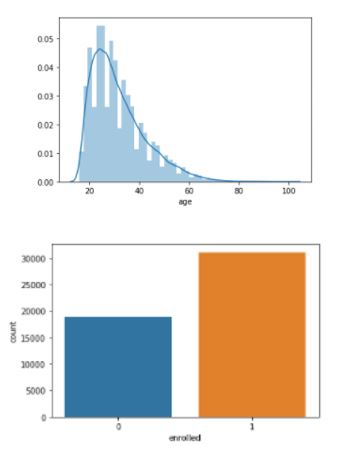

# Directing-customers-to-app-subscription

## Business Context and Objective

The FinTech company launch there android and iOS mobile based app and want to grow their business. But there is problem how to recommend this app and offer who really want to use it. So for that company decided to give free trial to each and every customer for 24 hour and collect data from the customers. In this scenario some customer purchase the app and someone not. According to this data company want to give special offer to the customer who are not interested to buy without offer and grow their business. 

In this project, we are working on financial application data and predict the customer who will take a premium version app subscription or not. Then the company will take action on the customers to give the offers or not. The data contain the customer’s behaviour and our job to find the insights from it.

This app used for financial purposes like bank loans, savings, etc. in one place. It has two versions free and premium. The free version app contains basic features and customer wants to use the premium feature then they have to pay some amount to unlock it.

The main goal of the company is to sell the premium version app with low advertisement cost but they don’t know how to do it. That’s a reason they are provided the premium feature in the free version app for 24 hours to collect the customer’s behaviour. After that, the company hired the Machine Learning Engineer to find insight from the collected data (customer’s behaviour).

Our job is to find or predict new customer who is interested to buy the product or not. If the customers will buy a product anyway so no need to give an offer to that customer and loss the business. Only give offers to those customers who are interested to use premium version app but they can’t afford its cost. So the company will give offers to those customers and earn more money.

## Dataset Information

1. user: Unique ID for each user.  
2. first_open: Date (yy-mm-dd) and time (Hour:Minute:Seconds:Milliseconds) of login on app first time.  
3. dayofweek: On which day user logon.  
	0: Sunday  
	1: Monday  
	2: Tuesday  
	3: Wednesday  
	4: Thursday  
	5: Friday  
	6: Saturday  
4. Hour: Time of a day in 24-hour format customer logon. It is correlated with dayofweek column.  
5. age: The age of the registered user.  
6. screen_list: The name of multiple screens seen by customers, which are separated by a comma.  
7. numscreens: The total number of screens seen by customers.  
8. minigame: Tha app contains small games related to finance. If the customer played mini-game then 1 otherwise 0.  
9. used_premium_feature: If the customer used the premium feature of the app then 1 otherwise 0.  
10. enrolled: If the user bought a premium feature app then 1 otherwise 0.  
11. enrolled_date: On the date (yy-mm-dd) and time (Hour:Minute:Seconds:Milliseconds) the user bought a premium features app.  
12. liked: The each screen of the app has a like button if the customer likes it then 1 otherwise 0.  

## Exploratory Data Analysis

## Outlier Detection and Treatment

Correlation Matrix

## Feature Engineering

1. The number was extracted from “hour” feature  
2. The ‘Screen_list’ contains string values but we can’t use it directly. So to solve this problem we are taking each screen name from ‘finTech_app_screen_Data’ and append as a column by the same name to ‘finTech_appData’. Then check this screen name is available in ‘screen_list’ if it is available then add value 1 else 0 in the appended column.  
3. Those screens that are not availble in ‘fineTech_app_screen_Data’ that are counted and conted number store in new column by name ‘remain_screen_list’.  

Creation of New Attributes:
1. A new feature “Time to enroll” was created as,  
Time to enrol = (Enrolled date) – (App first opened)  
2.Creates features for saving_screens_count, credit_screens_count, cc_screens_count and loan_screens_count by counting the screens viewed in particular category  

## Model Training and Evaluation:

### Performed Feature Scaling using Standand Scaler.  

### The models were trained on both scaled and non-scaled data.

The ML models trained were:  
1. DecisionTreeClassifier  
2. KNeighborsClassifier  
3. GaussianNB  
4. RandomForestClassifier  
5. LogisticRegression  
6. Support Vector Machines  
7. XgBoost Classifier  

XgBoost Classifier gave the best results:

## Feature Importances:

